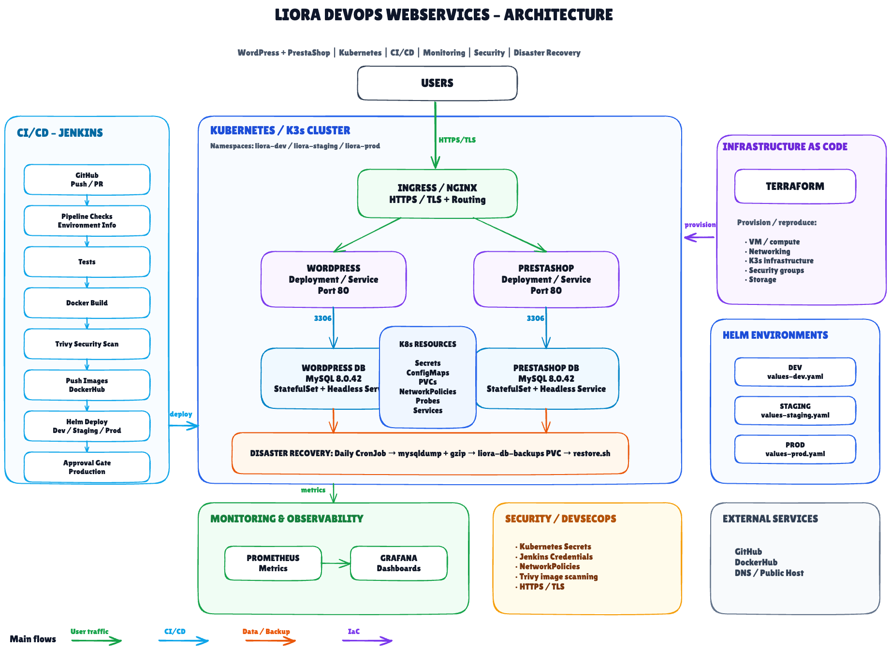

# Liora DevOps Webservices

DevOps bootcamp group project focused on building, containerizing, deploying, securing, monitoring, and operating a web services platform using WordPress, PrestaShop, NGINX, Docker, Kubernetes/K3s, Helm, Jenkins CI/CD, Terraform, Prometheus, Grafana, and disaster recovery mechanisms.

The platform runs WordPress and PrestaShop as containerized applications behind a central NGINX reverse proxy and supports multiple deployment environments.


## Features

- NGINX reverse proxy and centralized routing
- WordPress and PrestaShop behind a single public endpoint
- Separate MySQL databases for WordPress and PrestaShop
- Docker based local and VM deployment
- Automatic public IP detection and NGINX configuration update
- Development, staging, and production environment configurations
- Kubernetes/K3s orchestration
- Helm-based Kubernetes deployment
- Jenkins CI/CD pipeline with production approval gate
- Automated health, smoke, integration, routing, network, and Kubernetes validation tests
- Automated Docker image build and publishing to Docker Hub
- Trivy container vulnerability scanning
- Kubernetes Secrets and NetworkPolicies
- HTTPS/TLS support
- Prometheus and Grafana monitoring and observability
- Terraform Infrastructure as Code (IaC)
- Scheduled and manual database backups with restore workflow
- One-command Docker deployment using `deploy.sh`


## Architecture

The following diagram shows the overall architecture of the Liora DevOps Webservices platform, including application traffic, Kubernetes workloads, CI/CD, security, monitoring, Infrastructure as Code, and disaster recovery.



The editable Excalidraw source is available at:

```text
docs/architecture/devops-webservices.excalidraw
```

### Application Flow

```text
Users
  |
  | HTTP / HTTPS
  v
Ingress / NGINX
  |
  +-------------------+
  |                   |
  v                   v
WordPress          PrestaShop
  |                   |
  v                   v
WordPress DB       PrestaShop DB
```

Only the routing layer is exposed publicly. The application and database services communicate internally through the container or Kubernetes network.

---

## Technology Stack

| Area | Technologies |
|---|---|
| Applications | WordPress, PrestaShop |
| Reverse Proxy | NGINX |
| Databases | MySQL 8 |
| Containers | Docker, Docker Compose |
| Orchestration | Kubernetes / K3s |
| Package Management | Helm |
| CI/CD | Jenkins |
| Container Registry | Docker Hub |
| Security | Trivy, Kubernetes Secrets, NetworkPolicies, HTTPS/TLS |
| Monitoring | Prometheus, Grafana |
| Infrastructure as Code | Terraform |
| Disaster Recovery | Kubernetes CronJob, mysqldump, gzip, PVC |

---

# Docker Deployment

## 1. Make the deployment script executable

```bash
chmod +x deploy.sh
```

## 2. Start the project

```bash
./deploy.sh
```

The deployment script automatically:

- detects the current public IP
- updates the NGINX configuration
- rebuilds containers when required
- starts the required services


## VM Restart / Public IP Change

Whenever the VM is restarted or its public IP changes, run:

```bash
./deploy.sh
```

This ensures that the current public IP is detected and the application configuration is updated accordingly.


## Check the Detected Public IP

```bash
export SERVER_HOST="$(curl -fsS https://checkip.amazonaws.com | tr -d '\n'):8080"

echo "$SERVER_HOST"
```


## Check Container Status

```bash
docker compose ps
```


## Health Check

```bash
curl -i http://127.0.0.1:8080/health
```

## Test WordPress

```bash
curl -IL --max-redirs 5 \
  -H "Host: ${SERVER_HOST}" \
  http://127.0.0.1:8080/wordpress/
```

## Test PrestaShop

```bash
curl -IL --max-redirs 5 \
  -H "Host: ${SERVER_HOST}" \
  http://127.0.0.1:8080/prestashop/
```

## View Logs

```bash
docker compose logs --tail=100 nginx
docker compose logs --tail=100 wordpress
docker compose logs --tail=100 prestashop
```

Follow logs in real time:

```bash
docker compose logs -f
```

# Environment Strategy

The project contains separate configurations for development, staging, and production.

Docker Compose:

```text
docker-compose.dev.yml
docker-compose.staging.yml
docker-compose.prod.yml
```

Helm:

```text
helm/liora/values-dev.yaml
helm/liora/values-staging.yaml
helm/liora/values-prod.yaml
```

This allows environment-specific configuration without maintaining separate application codebases.


# Testing

The project contains multiple test layers for validating the application and deployment infrastructure.

```text
tests/
├── health/
├── integration/
├── kubernetes/
├── network/
├── routing/
├── smoke/
├── support/
└── unit/
```

Run the test suite with:

```bash
chmod +x tests/run-tests.sh
chmod +x tests/smoke/smoke-test.sh

./tests/run-tests.sh
```

The Kubernetes validation scripts additionally verify deployment health after Helm deployment.

# Kubernetes / K3s

The containerized platform can also be deployed to a Kubernetes/K3s cluster.

The Kubernetes deployment includes the main application workloads:

- NGINX / routing layer
- WordPress
- PrestaShop
- WordPress MySQL database
- PrestaShop MySQL database
- Services
- PersistentVolumeClaims
- Kubernetes Secrets
- NetworkPolicies
- readiness and liveness probes

Kubernetes resources are available under:

```text
kubernetes/
```

# Helm

Helm is used to package and deploy the Kubernetes resources.

The chart is located at:

```text
helm/liora/
```

Environment-specific values are provided through:

```text
values-dev.yaml
values-staging.yaml
values-prod.yaml
```

Example development deployment:

```bash
helm upgrade --install liora \
  ./helm/liora \
  --namespace liora-dev \
  --create-namespace \
  -f helm/liora/values-dev.yaml
```

Helm deployment is also integrated into the Jenkins CI/CD workflow.

# CI/CD Pipeline

Jenkins automates the build, test, security, image publishing, and deployment workflow.

The pipeline covers the following high-level flow:

```text
Git Push / Pull Request
        |
        v
Pipeline Validation
        |
        v
Environment Checks
        |
        v
Tests
        |
        v
Docker Build
        |
        v
Trivy Security Scan
        |
        v
Push Images to Docker Hub
        |
        v
Helm / Kubernetes Deployment
        |
        v
Deployment Validation
        |
        v
Production Approval
```

The pipeline includes environment validation, Docker image creation, application testing, security scanning, image publishing, deployment, and post-deployment validation.

Production deployment is protected by a manual approval gate.


# Docker Hub Images

The CI/CD pipeline builds and publishes the following Docker images:

```text
shabbyalaei/liora-nginx
shabbyalaei/liora-wordpress
shabbyalaei/liora-prestashop
```

Images are versioned by the Jenkins build process and can also be published using the `latest` tag.

# Security / DevSecOps

Security controls are integrated into both the CI/CD pipeline and Kubernetes deployment.

The project includes:

- Trivy container image scanning
- Kubernetes Secrets
- Jenkins credentials for sensitive CI/CD values
- Kubernetes NetworkPolicies
- HTTPS/TLS support
- container vulnerability reporting

## Trivy Security Scanning

Docker images are scanned for HIGH and CRITICAL vulnerabilities with Trivy as part of the Jenkins CI pipeline.

The pipeline validates that Trivy is available on the Jenkins agent before starting the scan.

The current pipeline uses a report-oriented security policy. Fixable OS-level vulnerabilities are remediated where practical, while remaining application-level findings are documented and evaluated before dependency upgrades.

For additional information, see:

```text
docs/security.md
```

# HTTPS / TLS

The Kubernetes environment supports HTTPS using the Traefik Ingress Controller with TLS termination.

TLS configuration can be enabled through the Helm configuration when required.

For setup, deployment, and testing instructions, see:

```text
docs/https.md
```

# Monitoring & Observability

The project includes monitoring and observability components based on:

- Prometheus
- Grafana

Prometheus is used for metrics collection, while Grafana provides dashboards for visualization.

Monitoring resources are located under:

```text
monitoring/
```

This provides visibility into the Kubernetes environment and deployed workloads.

# Infrastructure as Code

Terraform is used to define infrastructure as code.

Terraform configuration is located under:

```text
terraform/
```

The infrastructure layer is separated from application deployment so that infrastructure provisioning and application lifecycle management can be handled independently.

# Disaster Recovery

The project includes a disaster recovery strategy for the WordPress and PrestaShop databases.

Database backups are performed using:

```text
Kubernetes CronJob
        |
        v
mysqldump
        |
        v
gzip compression
        |
        v
liora-db-backups PVC
```

The implementation is located under:

```text
disaster-recovery/
```

It provides:

- scheduled database backups
- manual on-demand backups
- separate WordPress and PrestaShop database dumps
- gzip compression
- timestamped backup directories
- seven-day backup retention
- manual database restoration
- dedicated backup PersistentVolumeClaim
- backup-related NetworkPolicies

A manual backup can be triggered using:

```bash
./disaster-recovery/scripts/backup-now.sh liora-dev
```

The backup and restore workflow has been validated for both WordPress and PrestaShop databases.

### Current Limitation

The current K3s environment uses the `local-path` storage class. Therefore, the backup PVC remains on the same Kubernetes node.

For a production-grade disaster recovery architecture, backups should additionally be stored outside the cluster using external storage such as S3, NFS, or another remote backup system.
# Stop the Docker Environment

```bash
docker compose down
```


# Complete Docker Reset

```bash
docker compose down -v
```

Then redeploy:

```bash
./deploy.sh
```

This recreates the applications with fresh database volumes.

# Rebuild After Configuration Changes

After modifying Docker or NGINX configuration, run:

```bash
./deploy.sh
```

Alternatively:

```bash
docker compose up -d --build --force-recreate
```

# Project Structure

```text
liora-devops-webservices/
│
├── disaster-recovery/
│   ├── kubernetes/
│   ├── scripts/
│   └── README.md
│
├── docker-setup/
│   ├── nginx/
│   ├── wordpress/
│   └── prestashop/
│
├── docs/
│   ├── architecture/
│   │   ├── devops-webservices.excalidraw
│   │   └── devops-webservices.png
│   ├── https.md
│   └── security.md
│
├── helm/
│   └── liora/
│       ├── templates/
│       ├── values.yaml
│       ├── values-dev.yaml
│       ├── values-staging.yaml
│       └── values-prod.yaml
│
├── kubernetes/
│
├── monitoring/
│
├── terraform/
│
├── tests/
│   ├── health/
│   ├── integration/
│   ├── kubernetes/
│   ├── network/
│   ├── routing/
│   ├── smoke/
│   ├── support/
│   └── unit/
│
├── docker-compose.yml
├── docker-compose.dev.yml
├── docker-compose.staging.yml
├── docker-compose.prod.yml
├── Jenkinsfile
├── deploy.sh
└── README.md
```


# Documentation

Additional documentation is available in the repository:

| Documentation | Location |
|---|---|
| Architecture Diagram | `docs/architecture/` |
| HTTPS / TLS | `docs/https.md` |
| Security & Vulnerability Management | `docs/security.md` |
| Disaster Recovery | `disaster-recovery/README.md` |
| Kubernetes Validation | `tests/kubernetes/README.md` |

---

# Project Goals

The main objective of this project is to demonstrate an end-to-end DevOps workflow rather than only deploying an application.

The project combines:

```text
Containerization
      ↓
Automated Testing
      ↓
CI/CD
      ↓
Security Scanning
      ↓
Container Registry
      ↓
Kubernetes / Helm
      ↓
Monitoring
      ↓
Infrastructure as Code
      ↓
Disaster Recovery
```

This architecture demonstrates how application deployment, infrastructure, security, observability, and recovery can be integrated into a single DevOps workflow.

---

# Known Limitations

This project was developed as part of a DevOps bootcamp and uses a lab-oriented K3s environment.

For a production deployment, additional improvements would include:

- external and geographically independent backup storage
- production DNS and certificate automation
- highly available Kubernetes control plane
- external secrets management
- centralized log aggregation
- remote Terraform state and state locking
- additional production security hardening

---

# Daily Development Workflow

```bash
cd ~/liora-devops-webservices

git pull

chmod +x deploy.sh
./deploy.sh

docker compose ps
```

---

## Architecture at a Glance

```text
                         USERS
                           |
                       HTTPS/TLS
                           |
                           v
                    INGRESS / NGINX
                      /          \
                     /            \
                    v              v
              WORDPRESS        PRESTASHOP
                   |                |
                   v                v
             WORDPRESS DB     PRESTASHOP DB
                    \              /
                     \            /
                      v          v
                    DB BACKUPS
                         |
                         v
                   BACKUP PVC


GitHub ---> Jenkins ---> Tests ---> Docker Build ---> Trivy
                          |
                          v
                     Docker Hub
                          |
                          v
                   Helm / Kubernetes


Kubernetes ---> Prometheus ---> Grafana

Terraform ---> Infrastructure
```